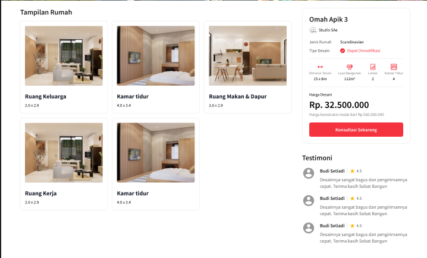

<h1 align="center">
  Sobat Bangun
</h1>
<div align="center">
  
</div>


## Built With

- [Next.js]
- [TaiwindCSS]

## 🛠 Installation & Set Up

1. Clone the repo
   ```sh
   git clone https://github.com/rdhss/sobatBangun.git
   ```
1. change dir
   ```sh
   cd sobatBangun
   ```
2. Install NPM packages
   ```sh
   npm install
   ```
3. Start the Application
   ```sh
   npm run serve